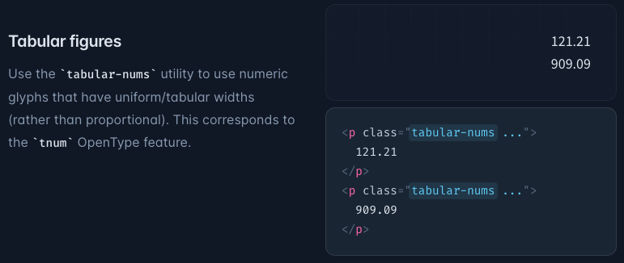

# Frontend Coding guidelines

- [Frontend Coding guidelines](#frontend-coding-guidelines)
  - [refs](#refs)
  - [Code Format](#code-format)
  - [i18n](#i18n)
  - [CSS](#css)
    - [`tabular-nums` for Number](#tabular-nums-for-number)
    - [classNames](#classnames)
  - [Testing](#testing)
    - [Must](#must)
      - [1. the logic code is nested.](#1-the-logic-code-is-nested)
    - [Unit Testing](#unit-testing)
      - [user-event](#user-event)
      - [custom render](#custom-render)
    - [waitFor must be after of await](#waitfor-must-be-after-of-await)
  - [Form](#form)
  - [File Structure](#file-structure)
  - [SVG](#svg)
  - [React](#react)
    - [Write children in Props if it is necessary, Don't use `React.FC`.](#write-children-in-props-if-it-is-necessary-dont-use-reactfc)
    - [Primary handle functions should not be optional](#primary-handle-functions-should-not-be-optional)
    - [useEffect tip: don't](#useeffect-tip-dont)
    - [Avoid use spread operator in Component](#avoid-use-spread-operator-in-component)
    - [use children to pass complex UI](#use-children-to-pass-complex-ui)
    - [Try to use HTML native input component](#try-to-use-html-native-input-component)
    - [The component always return DOM](#the-component-always-return-dom)
  - [Naming](#naming)
    - [Component name is same as file name](#component-name-is-same-as-file-name)
    - [React props must be camelCase](#react-props-must-be-camelcase)
    - [Don't use `state` as suffix](#dont-use-state-as-suffix)
    - [react-query useQuery key](#react-query-usequery-key)
    - [Data Sync use suffix `Query` and `Mutation`](#data-sync-use-suffix-query-and-mutation)
    - [Don't write callback in `.mutate` of React Query, write in `useMutation`](#dont-write-callback-in-mutate-of-react-query-write-in-usemutation)
    - [useQueryClient vs. new QueryClient](#usequeryclient-vs-new-queryclient)
    - [Don't use common name](#dont-use-common-name)
  - [export and import](#export-and-import)
  - [Storybook](#storybook)
  - [UI](#ui)
    - [Don't throw Error in UI](#dont-throw-error-in-ui)
    - [Don't ignore or hide or filter user's Data](#dont-ignore-or-hide-or-filter-users-data)
    - [Don't filter in frontend for the data with pagination](#dont-filter-in-frontend-for-the-data-with-pagination)

## refs

- file structure: [Redwood File Structure](https://redwoodjs.com/docs/tutorial/chapter1/file-structure)
- JavaScript Style Guide: [Airbnb JavaScript Style Guide](https://github.com/airbnb/javascript)
- TypeScript coding guidelines: [jaredpalmer/typescript](https://github.com/jaredpalmer/typescript)
- [Naming cheatsheet](https://github.com/kettanaito/naming-cheatsheet)

## Code Format

1. JS file lines limit 400.

## i18n

- key must lowercase, like: "hello world", "system settings".

## CSS

1. Use utility-first CSS ([tailwindcss](https://tailwindcss.com/docs/utility-first)).

   1. Don't construct class names dynamically, Always use complete class names. see [tailwind document](https://tailwindcss.com/docs/content-configuration#dynamic-class-names)
   2. Use unprefixed utilities to target mobile, and override them at larger breakpoints. see [document](https://tailwindcss.com/docs/responsive-design#targeting-mobile-screens)
   3. Extracting classes with @apply is last resort [document](https://tailwindcss.com/docs/reusing-styles#avoiding-premature-abstraction)

2. Don't use SCSS, Less and CSS-in-JS.
3. Don't use `fontWeight: 500`, because a lot of issues.

### `tabular-nums` for Number




### classNames

good

```js
classNames("foo", { bar: true }); // => 'foo bar'
```

bad

```js
classNames("foo", true && "bar"); // => 'foo bar'
```

## Testing

### Must

#### 1. the logic code is nested.

```ts
// Must write test
const onCheckedChange = (checked: boolean) => {
  updateTask.mutate({
    ...todo,
    tasks: todo.tasks?.map((t) =>
      t.id === task.id
        ? {
            ...t,
            items: t.items.map((taskItem, itemIndex) =>
              itemIndex === idx ? { ...taskItem, checked } : taskItem
            ),
          }
        : t
    ),
  });
};
```

### Unit Testing

https://testing-library.com/docs/react-testing-library/example-intro

1. mock and setup inside of the test itself.
2. recommend [user-event](https://testing-library.com/docs/user-event/intro)
3. don't use `test-id`

#### user-event

```js
import userEvent from "@testing-library/user-event";

test("renders", () => {
  const user = userEvent.setup();

  user.click(getByText("register"));
});
```

#### custom render

```js
import { render } from "../../utils/testUtils";
```

### waitFor must be after of await

Good

```js
await waitFor(() => {
  ...
})
```

Bad

```js
waitFor(() => {
  ...
})

// even the inside of waitFor test failed, the test will not fail.
```

## Form

1. schema validation.
2. first validation after first submit.
3. real validation after submit.

## File Structure

- Don’t overthink it.
- Structure files of changed together.

## SVG

We don't use svg directly, we published a npm.

```
npm install @sodaicons/react
```

```
yarn add @sodaicons/react
```

## React

### Write children in Props if it is necessary, Don't use `React.FC`.

https://stackoverflow.com/questions/71788254/react-18-typescript-children-fc/71809927#71809927

### Primary handle functions should not be optional

bad code

```ts
type Props = {
  onOk?: Function;
};

if (onOk) {
  onOk();
}
```

good code

```ts
type Props = {
  onOk: Function;
};

onOk();
```

### useEffect tip: don't

bad

```js
TODO:
```

good

```js
TODO:
```

### Avoid use spread operator in Component

Good

```js
<MemberCard member={member} shadow={true} border={"dashed"} />
```

Bad

```js
const data = { member: {name: "jiang jifa"}, shadow: true, border: "dashed" }
<MemberCard {...data} />
```

### use children to pass complex UI

Good

```diff
export type ModalProps = {
  title: string;
  description?: string;
+  children?: ReactNode;
```

Bad

```diff
export type ModalProps = {
  title: string;
-  description?: string;
+  description?: ReactNode;
```

### Try to use HTML native input component

Good

```html
<input type="checkbox" />
```

Bad

```js
import * as Checkbox from "@radix-ui/react-checkbox";
export default () => (
  <Checkbox.Root>
    <Checkbox.Indicator />
  </Checkbox.Root>
);
```

### The component always return DOM

Good

```js
const SomeComponent = {
  // ...
  return <></>;
}

const SomeComponent = {
  // ...
  return <>Hello</>;
}
```

Bad

```js
const SomeComponent = {
  // ...
  return null;
}

const SomeComponent = {
  // ...
  return "Hello";
}
```

## Naming

### Component name is same as file name

Good

```ts
import MemberNewCell from "../../components/MemberNewCell/MemberNewCell";
```

Bad

```js
import MemberAdditionalCell from "../../components/MemberNewCell/MemberNewCell";
```

### React props must be camelCase

### Don't use `state` as suffix

Bad

```js
const [submittingState, setSubmitting] = useState(false);
```

Good

```js
const [isSubmitting, setSubmitting] = useState(false);
```

### react-query useQuery key

```js
useQuery([<api endpoint>, <params>])

// e.g.
useQuery(["procedures", id])
```

### Data Sync use suffix `Query` and `Mutation`

Example:

```
userQuery
usersQuery
createUserMutation
updateUserMutation
```

### Don't write callback in `.mutate` of React Query, write in `useMutation`

Good

```js
const updateMutation = useMutation(mutationFn, {
  onSuccess: () => {
    setResultModalVisible(true);
  },
});

updateMutation.mutate(data);
```

Bad

```js
updateMutation.mutate(data, {
  onSuccess: () => {
    setResultModalVisible(true);
  },
});
```

### useQueryClient vs. new QueryClient

- useQueryClient inside React Component
- new QueryClient outside React Component

### Don't use common name

Good

```js
FormWrapper;

QueryWrapper;

I18nWrapper;
```

Bad

```js
Wrapper;
```

## export and import

* Use `export` instead of `export default`.
* No need to use `export { ... }`
* No need to define `index.ts` to organize import and export

## Storybook

1. All Figma page should have stories.
2. Common loading UI and common failure are useless.
3. Responsive Design: SmartPhone, Tablet, PC and big screen.

## UI

### Don't throw Error in UI

- UI shouldn't crash.

You can use `ErrorBoundary` or `Error Component`.

### Don't ignore or hide or filter user's Data

Even user's data is invalid, show some message, don't hide.
We don't deal user's data.

### Don't filter in frontend for the data with pagination
